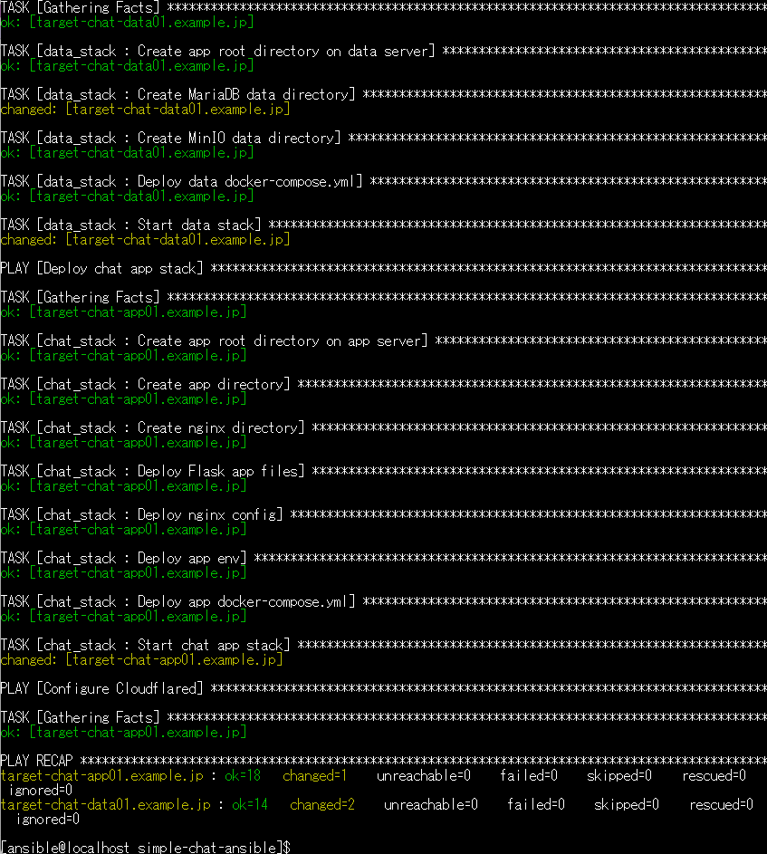
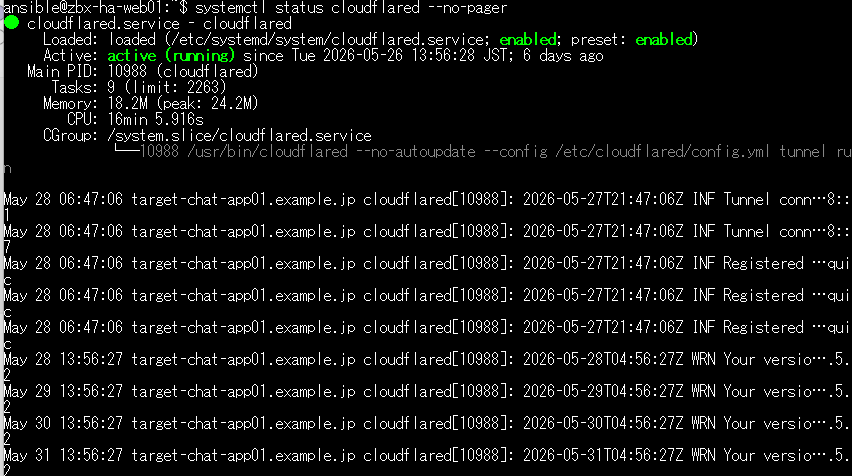
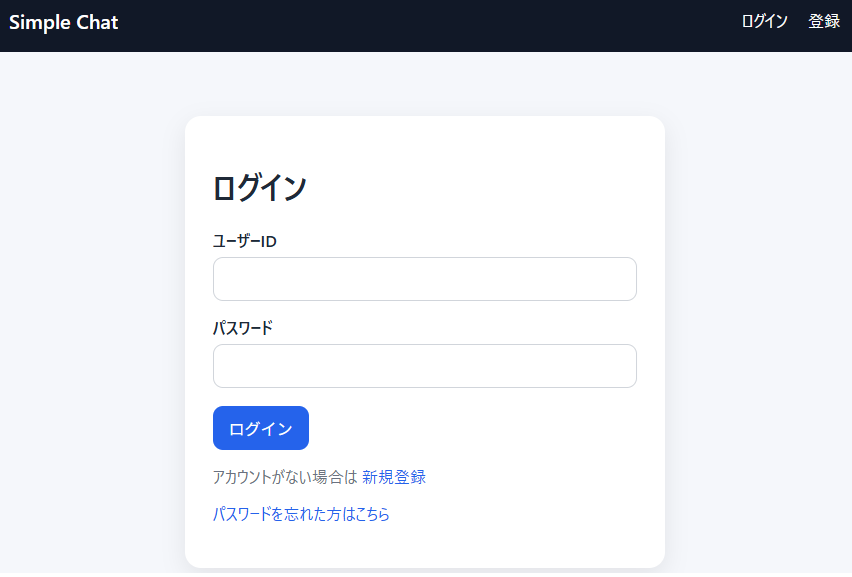
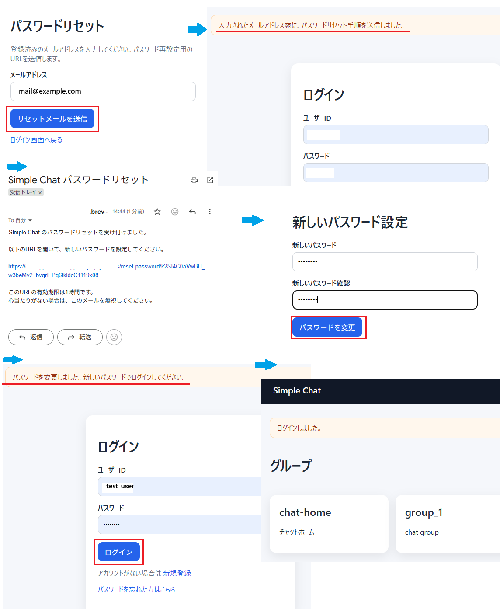
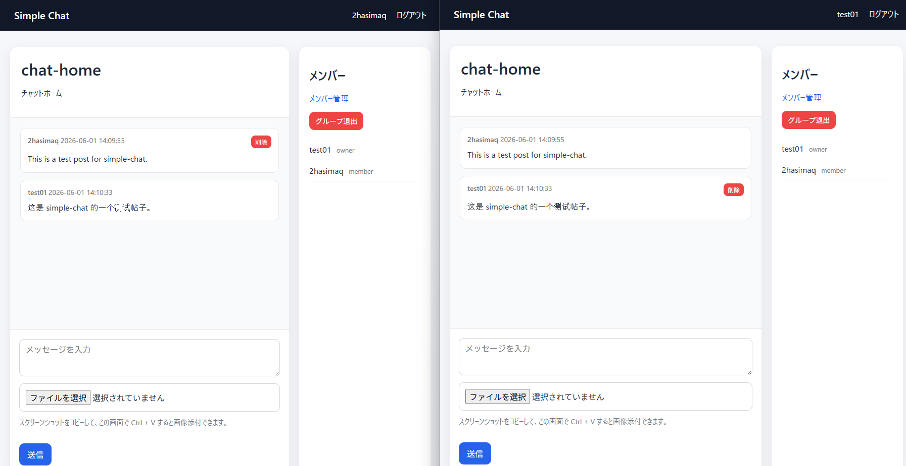
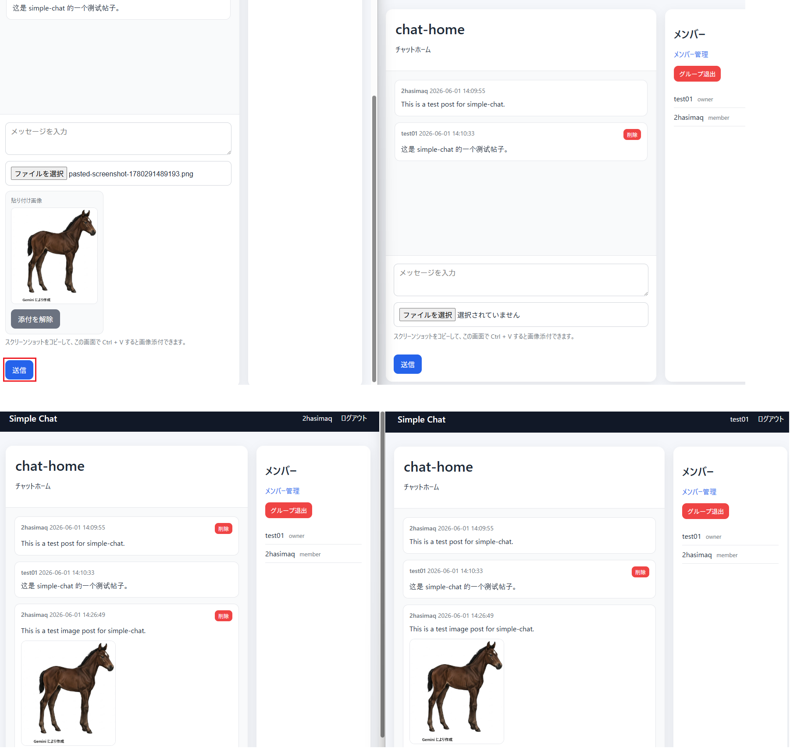
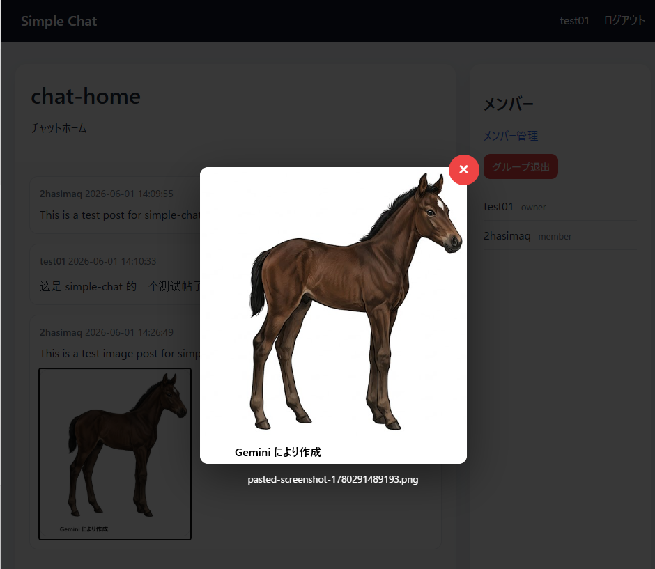
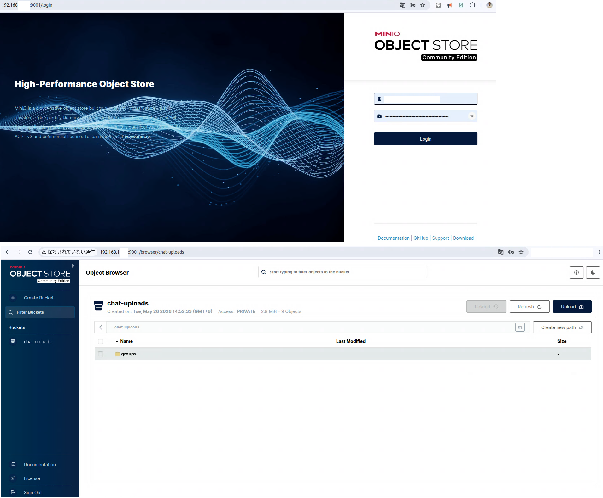

# simple-chat-ansible

Ansible project for deploying a lightweight self-hosted group chat application on Ubuntu Server 24.04.

This project demonstrates how to deploy a small web application stack using Ansible, Docker Compose, nginx, Flask, MariaDB, MinIO, Cloudflare Tunnel, and SMTP-based email delivery.

## Overview

This project deploys a simple self-hosted group chat system using a two-VM architecture.

The system supports user registration, user ID based login, password reset email, group creation, member management, text chat, image upload, screenshot paste upload, image preview, message deletion, and external publishing through Cloudflare Tunnel.

The main purpose of this project is to demonstrate:

- Web application deployment automation with Ansible
- Docker Compose based application deployment
- Flask application hosting behind nginx
- MariaDB persistence
- MinIO object storage for uploaded images
- Cloudflare Tunnel based external publishing
- SMTP integration for password reset email

## Architecture

```text
Internet
  |
  | HTTPS
  |
Cloudflare Tunnel
  |
chat-app01
  - nginx
  - Flask
  - cloudflared
  |
chat-data01
  - MariaDB
  - MinIO
```

## Screenshots / Verification

This section shows screenshots and verification results for the deployed simple chat application.

For security reasons, IP addresses, hostnames, URLs, usernames, email addresses, and environment-specific values may be masked in the screenshots.

### Ansible Playbook Result



This screenshot shows the Ansible playbook execution result.

The playbook deploys the data stack, chat application stack, and Cloudflare Tunnel configuration.

### Cloudflare Tunnel Status



This screenshot verifies the Cloudflare Tunnel configuration or service status for publishing the application externally.

Cloudflare Tunnel is used to expose the chat application without directly opening inbound ports on the server.

### Login Page



This screenshot shows the login page for the Simple Chat application.

The application supports user ID based login and account registration.

### Password Reset Flow



This screenshot shows the password reset workflow.

The application sends a password reset email through SMTP and allows the user to set a new password using a reset URL.

### Group Chat Page



This screenshot shows the group chat page.

The application supports group-based messaging, member display, member management, group leave, and message deletion.

### Image Upload



This screenshot shows image upload and screenshot paste upload functionality.

Users can attach an image file or paste a screenshot directly into the chat form.

### Image Upload Preview



This screenshot shows image preview and modal display functionality after an image is uploaded to the chat.

Uploaded images are stored in object storage and displayed from the chat interface.

### MinIO Object Storage



This screenshot shows the MinIO bucket used for uploaded chat images.

The application stores uploaded images in MinIO object storage instead of keeping them only on the application container filesystem.

## Features

- User registration
- User ID based login
-Password reset email via Brevo SMTP
-Group creation
- Member invitation
- Member removal
- Group leave
- Text chat
- Image upload
- Screenshot paste upload
- Image modal preview
- Message deletion
- Lightweight polling-based auto update
- MariaDB persistence
- MinIO object storage
- Cloudflare Tunnel external publishing

## Tech Stack

- Ansible
- Docker Compose
- nginx
- Flask
- MariaDB
- MinIO
- Cloudflare Tunnel
- Brevo SMTP

## Tested Environment

- Ubuntu Server 24.04
- Ansible 2.14+
- Docker / Docker Compose v2
- MariaDB 11 container
- MinIO container
- Python 3.12 Flask app container
- nginx container

## Directory Structure

```text
simple-chat-ansible/
├── README.md
├── ansible.cfg
├── inventory.ini
├── group_vars/
│   └── all.yml.example
├── roles/
│   ├── chat_stack/
│   │   ├── files/
│   │   │   ├── app/
│   │   │   │   ├── Dockerfile
│   │   │   │   ├── app.py
│   │   │   │   ├── requirements.txt
│   │   │   │   ├── static/
│   │   │   │   │   └── style.css
│   │   │   │   └── templates/
│   │   │   │       ├── base.html
│   │   │   │       ├── chat.html
│   │   │   │       ├── forgot_password.html
│   │   │   │       ├── groups.html
│   │   │   │       ├── login.html
│   │   │   │       ├── members.html
│   │   │   │       ├── new_group.html
│   │   │   │       ├── register.html
│   │   │   │       └── reset_password.html
│   │   │   └── nginx/
│   │   │       └── default.conf
│   │   ├── tasks/
│   │   │   └── main.yml
│   │   └── templates/
│   │       ├── app.env.j2
│   │       └── docker-compose.yml.j2
│   ├── cloudflared/
│   ├── common/
│   ├── data_stack/
│   └── docker/
└── site.yml
```

## Setup

Copy the example variables file:

```bash
cp group_vars/all.yml.example group_vars/all.yml
```

Edit `group_vars/all.yml` and set your own values.

Example values:

```yaml
flask_secret_key: "CHANGE_ME_SECRET_KEY"

db_password: "CHANGE_ME_DB_PASSWORD"
db_root_password: "CHANGE_ME_DB_ROOT_PASSWORD"

minio_access_key: "CHANGE_ME_MINIO_ACCESS_KEY"
minio_secret_key: "CHANGE_ME_MINIO_SECRET_KEY"

mail_username: "CHANGE_ME_BREVO_SMTP_LOGIN"
mail_password: "CHANGE_ME_BREVO_SMTP_KEY"
mail_default_sender: "no-reply@example.com"

cloudflared_tunnel_uuid: "CHANGE_ME_TUNNEL_UUID"
cloudflared_hostname: "chat.example.com"
```

## Inventory Example

```ini
[chat_app]
target-chat-app01.example.local

[chat_data]
target-chat-data01.example.local

[chat_all:children]
chat_app
chat_data

[chat_all:vars]
ansible_user=ansible
ansible_become=true
```

## Deploy

Check syntax:

```bash
ansible-playbook site.yml --syntax-check
```

Deploy all roles:

```bash
ansible-playbook site.yml
```

Deploy only the data stack:

```bash
ansible-playbook site.yml --limit chat_data
```

Deploy only the app stack:

```bash
ansible-playbook site.yml --limit chat_app
```

## Cloudflare Tunnel

Create a Cloudflare Tunnel manually first.

Place the tunnel credentials JSON on the app host:

```text
/etc/cloudflared/<TUNNEL_UUID>.json
```

Then configure these variables in `group_vars/all.yml`:

```yaml
cloudflared_enable: true
cloudflared_tunnel_name: "simple-chat"
cloudflared_tunnel_uuid: "<TUNNEL_UUID>"
cloudflared_credentials_file: "/etc/cloudflared/<TUNNEL_UUID>.json"
cloudflared_hostname: "chat.example.com"
cloudflared_service: "http://localhost:8080"
```

## Security Notes

Do not commit secrets.

The following files are intentionally ignored:

- `group_vars/all.yml`
- `.env`
- `app.env`
- Cloudflare credentials JSON
- certificate files
- private key files

Before publishing, check for secret files:

```bash
find . -type f \( -name "*.env" -o -name "*.json" -o -name "*.pem" -o -name "*.key" -o -name "*.crt" \) -print
```

Also check for sensitive strings:

```bash
grep -R -nE 'password|passwd|secret|token|api|key|private|vault|Authorization|Bearer' .
```

## Notes

This project is for lab, learning, and portfolio demonstration.

Additional security hardening, monitoring, backup, logging, and operational review are required for production use.

## License

MIT

